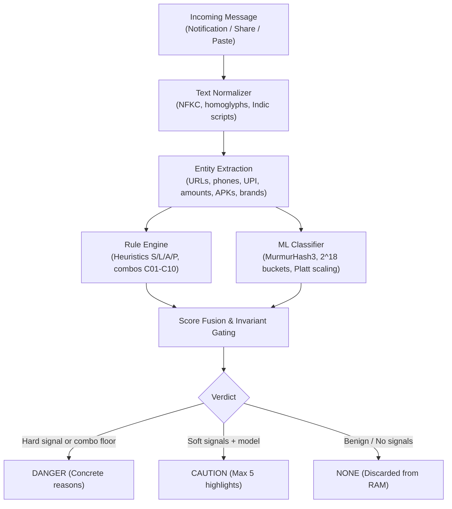

# Duarf

On-device scam detection for WhatsApp on Android. The name is "fraud" spelled backwards.

> **Status**: Early development (milestone M4 of 6). Not on the Play Store yet. Not a substitute for user caution.
> What works today: notification monitoring, share sheet inspection, rule engine, ML featurizer and linear classifier, local Keystore encryption, and privacy CI enforcement.
> What does not work today: image/screenshot OCR, regional languages beyond English/Hindi, and automated background pack updates.

---

## What It Does

Duarf runs entirely on your phone to identify fraud, phishing, and malicious attachments in incoming WhatsApp messages before you interact with them. It reads notification text locally, extracts indicators like APK filenames, suspicious links, and urgency claims, and displays an on-device warning banner with concrete reasons. Benign personal messages are analyzed in memory and immediately discarded.

Example alert for an APK lure from an unknown sender:
```text
DANGER: Malicious App Attachment
Sender: +91 XXXXX XXXXX
File: RTO E challan.apk

Reasons:
- The attachment is an Android application package (.apk), not a document or traffic receipt.
- The sender is an unsaved phone number claiming official government authority.
- Android will prompt to install software if opened.

Recommended action: Do not open or install this file. Delete the message.
```

---

## How It Works



1. **Capture**: Intercepts WhatsApp notification text via Android's `NotificationListenerService`, system text selection ("Check with DUARF"), or direct share sheet intent.
2. **Normalization**: Standardizes Unicode via NFKC, preserves zero-width joiners for Indic scripts, folds Cyrillic/Greek homoglyphs, and maps Indic numerals.
3. **Entity Extraction**: Identifies URLs (including obfuscated formats like `hxxp` and userinfo tricks), Indian mobile numbers, UPI handles, currency amounts, OTP codes, and APK extensions.
4. **Parallel Scoring**:
   - **Rule Engine**: Evaluates link, sender, action, and urgency heuristics, applying combo floors (such as APK + unknown sender $\ge 0.85$).
   - **ML Classifier**: Featurizes text into $2^{18}$ MurmurHash3 buckets with an int8 quantized elastic-net model calibrated via Platt scaling.
5. **Score Fusion**: Combines rule and model probabilities using a dampened noisy-OR formula.
6. **Product Rule Gating (Section 10)**: A `DANGER` alert strictly requires a hard signal (`L01`, `L10`, `L11`, `A01`, `A02`, `A04`), an active combo floor, or a high-risk domain signal (`L02`, `L03`, `L07`, `L09`). The ML model and soft signals can reach `CAUTION` at most ($m' \le 0.719$), guaranteeing that aggressive alerts always cite a concrete deterministic violation.

---

## Privacy Architecture

Duarf operates under strict architectural guarantees documented in [docs/ARCHITECTURE.md](docs/ARCHITECTURE.md):

- **Zero Network Permissions**: The app does not request `android.permission.INTERNET`. It cannot communicate over the network.
- **Zero Third-Party SDKs**: No Google Analytics, Firebase, Crashlytics, Sentry, ads, or network client libraries are included in release builds.
- **Benign Discard**: Benign messages are analyzed strictly in volatile memory and are never persisted to SQLite, Room, or disk.
- **Local Encryption**: Flagged alerts are encrypted with AES-256-GCM using keys stored in the hardware-backed Android Keystore, with HMAC-SHA256 integrity validation.
- **Automatic Purge**: Alerts older than the retention period (default 30 days) are automatically deleted upon insertion and on demand.
- **Audited Logging**: Application logs use integer event codes only (`SafeLog`). Raw message text, phone numbers, and keys are never logged.

### Verify It Yourself

You can verify the binary's privacy guarantees independently:

1. **Inspect on Device**: Go to **Settings > Apps > DUARF > Permissions**. The system reports "No permissions requested" or "No permissions allowed".
2. **Inspect APK Permissions**:
   ```bash
   apkanalyzer manifest permissions app/build/outputs/apk/debug/app-debug.apk
   ```
   Output lists only `POST_NOTIFICATIONS`, `VIBRATE`, and dynamic receiver permissions. `android.permission.INTERNET` is absent.
3. **Inspect Dependencies**:
   ```bash
   ./gradlew :app:dependencies --configuration releaseRuntimeClasspath
   ```
   No network, analytics, or remote tracking libraries appear.
4. **Run Invariant CI Checks**:
   ```bash
   ./gradlew check
   ```
   Enforces `verifyPermissions`, `verifyDependencies`, `verifyNoContentLogging`, and `verifyEngineIsPure`.

---

## Limitations

Duarf cannot protect against every vector. Known architectural constraints include:

- **Muted Chats**: Android does not post notification events for muted conversations, preventing capture.
- **Foreground Messages**: Messages read while a chat is actively open on screen do not generate notifications.
- **Truncated Notifications**: Android notification previews truncate messages longer than roughly 500 characters. Full text requires manual paste or share sheet check.
- **Images and Voice Notes**: The MVP does not perform OCR on images or audio transcription on voice notes. Scams contained entirely within screenshot flyers cannot be read automatically.
- **Work Profiles and Cloned Apps**: Separate work or dual-instance installations require independent notification listener enrollment.
- **Offline Updates**: Because Duarf lacks network access, detection rules and model weights only update when you update the application package.
- **Known M4 Detection Gap**: Obfuscated scams using descriptive Indic paraphrasing (such as "गुप्त सत्यापन कोड" instead of "OTP") wrapped in security advisory pretexting are currently caught at lower recall (adversarial recall 0.50, Hindi recall 0.886). Hardening is scheduled for M6.

---

## Supported Languages

| Language | Code | Current Status |
| :--- | :--- | :--- |
| English | `en` | Supported (Tier 1) |
| Hindi (Devanagari) | `hi` | Supported (Tier 1) |
| Hinglish (Latin script) | `hi-Latn` | Supported (Tier 1) |
| Regional Indic (Marathi, Tamil, Telugu, etc.) | - | Planned for Milestone M5 |

---

## Accuracy & Evaluation

Evaluated strictly once on the frozen synthetic test split (`eval/m4_fresh_test_report.json`, 3,200 rows; 1,200 scam, 2,000 benign):

| Metric | Target | Actual | Gate Status |
| :--- | :--- | :--- | :--- |
| **Total Test Rows** | $\ge 3,000$ | **3,200** | PASS |
| **Danger Precision** | $\ge 0.97$ | **1.000** | PASS |
| **Caution+ Recall** | $\ge 0.90$ | **0.957** | PASS (Overall) |
| **Benign Raised to Danger** | $\le 0.3\%$ | **0.0%** (0 / 2,000) | PASS |
| **Benign Raised to Caution** | $\le 2.0\%$ | **0.0%** (0 / 2,000) | PASS |
| **Rules-only vs Rules+ML Recall** | - | **0.648 $\to$ 0.957** (+30.9 pp) | PASS |
| **Adversarial Subset Recall** | - | **0.500** (47 / 94) | Known gap |
| **Tier 1 Per-Language Gates** | All $\ge 0.90$ | `en`: 1.0, `hi-Latn`: 0.987, `hi`: 0.886 | **FAIL** (`hi` recall < 0.90) |

*Real-world check*: Scored traffic challan APK lure (`eval/real_world.jsonl`) evaluated to `DANGER` (score 0.969, rule score 0.85).

> **Important**: The numbers above reflect synthetic template generation designed to measure heuristic coverage and false alarm suppression. Real-world accuracy remains unproven until field evaluation on live messages is complete.

---

## Project Structure

| Module / Directory | Purpose |
| :--- | :--- |
| [`:app`](app/) | Android application module with Jetpack Compose UI, Hilt DI, and settings. |
| [`:capture`](capture/) | Notification listener service, message deduplicator, and share sheet handlers. |
| [`:engine`](engine/) | Pure Kotlin rule engine, text normalizer, entity extractor, and ML featurizer. |
| [`:data`](data/) | Encrypted Room database, Keystore encryption, retention cleaner, and SafeLog. |
| [`:engine-cli`](engine-cli/) | Command-line developer tool for testing, featurizing, and evaluating datasets. |
| [`packs/`](packs/) | Detection rules (`rules.json`), brand database, PSL, and model weights (`model.bin`). |
| [`ml/`](ml/) | Python training scripts, synthetic dataset generators, and requirement specs. |
| [`eval/`](eval/) | Evaluation datasets (`corpus.jsonl`, `real_world.jsonl`) and test result reports. |
| [`tools/ci/`](tools/ci/) | Gradle verification tasks enforcing zero-network and zero-logging invariants. |

---

## Build & Run

### Prerequisites

- **Java Development Kit**: JDK 21 (uses Android Studio embedded JBR or OpenJDK 21).
- **Android Studio**: Koala / Ladybug or newer.
- **Android SDK**: `compileSdk = 36`, `targetSdk = 36`, `minSdk = 26`.
- **Python** (for ML pipeline): Python 3.9+.

### Build Commands

```bash
# 1. Run unit test suite across all modules
export JAVA_HOME="/Applications/Android Studio.app/Contents/jbr/Contents/Home"
./gradlew test

# 2. Run CI invariant checks (manifest permissions, dependencies, pure engine)
./gradlew check

# 3. Assemble debug APK
./gradlew assembleDebug

# 4. Install onto connected Android device or emulator
adb install -r app/build/outputs/apk/debug/app-debug.apk

# 5. Grant notification listener access via ADB (or through Android Settings)
adb shell cmd notification allow_listener com.duarf.app.debug/com.duarf.capture.notification.WaNotificationListener
```

### Run Engine CLI

```bash
# Analyze and explain a message text
./gradlew :engine-cli:run --args="explain --text 'Dear customer, your SBI account is blocked. Download sbi_update.apk from http://sbi-kyc-verify.xyz/update immediately.'"

# Run corpus evaluation report
./gradlew :engine-cli:run --args="eval --in eval/corpus.jsonl"
```

---

## Training the Model

The on-device model is a linear classifier trained via scikit-learn in under 3 minutes on a laptop CPU:

```bash
# 1. Setup Python virtual environment
python3 -m venv ml/venv
source ml/venv/bin/activate
pip install -r ml/requirements.txt

# 2. Generate training and development dataset splits
python ml/generate_dataset.py

# 3. Featurize JSONL into LIBSVM format using the Kotlin featurizer
./gradlew :engine-cli:run --args="featurize --in ml/data/train.jsonl --out ml/data/train.svm"
./gradlew :engine-cli:run --args="featurize --in ml/data/dev.jsonl --out ml/data/dev.svm"

# 4. Train elastic-net logistic regression, calibrate Platt parameters, and export model.bin
python ml/train.py
```

The resulting `packs/model/model.bin` (262,176 bytes) and `packs/model/model.json` are packaged into app assets automatically during build.

---

## Roadmap

- [x] **Milestone M0**: Invariants and CI checks (zero network, forbidden libraries, pure engine).
- [x] **Milestone M1**: Pure Kotlin engine core (normalizer, extractors, rules, CLI).
- [x] **Milestone M2**: Notification capture, deduplication, and share target.
- [x] **Milestone M3**: Encrypted storage, retention purge, Compose UI, Section 16.4 privacy tests.
- [x] **Milestone M4**: Kotlin featurizer, linear classifier, Platt calibration, product rule gating, evaluation reports.
- [ ] **Milestone M5**: System integration, performance benchmarking on physical hardware, regional language packs.
- [ ] **Milestone M6**: Hardening, adversarial evasion defense (M6 plan), battery profiling, release signing.

### Post-MVP Ideas

- On-device OCR for traffic violation and banking notice screenshots.
- Support for SMS and Telegram message notifications.
- Local family protection mode (optional high-risk notification relay between paired devices).

---

## Contributing

1. **Adding Rules or Signals**: Rules are defined in [`packs/rules.json`](packs/rules.json). Language lexicons live in [`packs/lang/{lang}.json`](packs/lang/). All regexes must behave identically across JVM and Android ICU without unsupported flags.
2. **Evaluation Protocol**: Test split results are strictly frozen. When false negatives are found, developers must **never** tune rules, lexicons, or training templates to match test split rows directly. Corrections must be addressed through development splits (`dev`, `dev2`, `dev3`).
3. **Invariant Enforcement**: Every pull request must pass `./gradlew check`. Any attempt to introduce network permissions, tracking SDKs, or raw content logging will fail the build.

---

## Disclaimer

Duarf is an independent open-source project and is not affiliated with, sponsored by, or endorsed by WhatsApp or Meta Platforms, Inc. The name "WhatsApp" is used exclusively to denote application compatibility.

---

## License

License: TBD (Tracked in [`OPEN_QUESTIONS.md`](OPEN_QUESTIONS.md))

<!-- TODO: Add application screenshots once UI review is complete -->
<!-- TODO: Add Google Play Store download link once released -->
