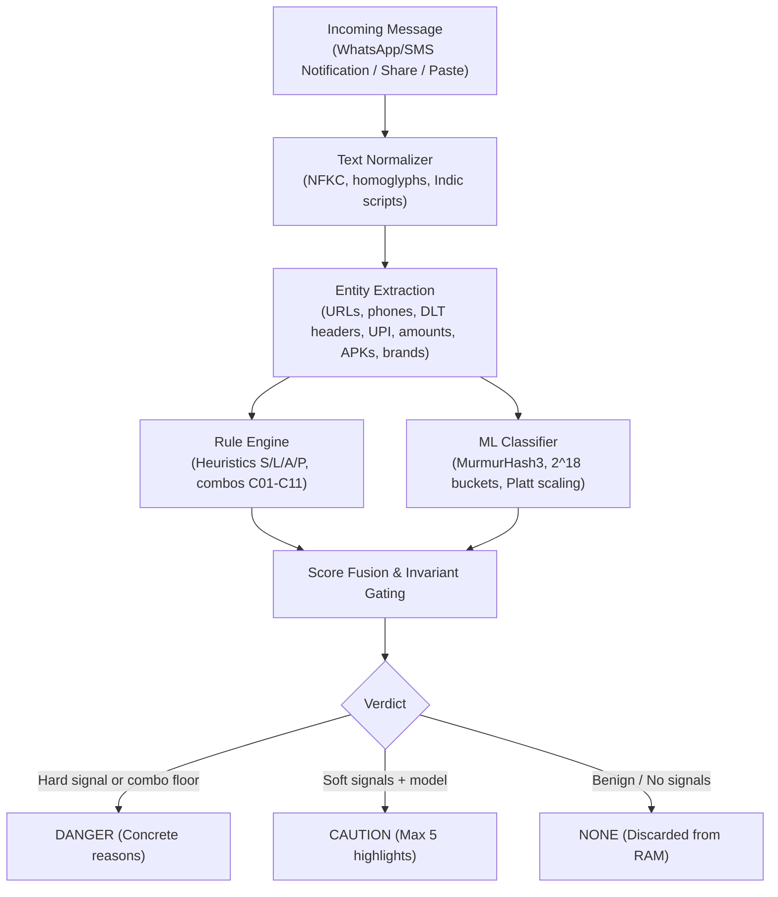

# Duarf

[](LICENSE)

On-device scam detection for WhatsApp and SMS on Android. Checks WhatsApp and SMS notifications. Never reads your inbox. The name is "fraud" spelled backwards.

> **Status**: Milestones M0–M6 complete. Preparing for Play closed testing (12 testers for 14 days). Verified on a Pixel 7 emulator; not yet tested on physical phones.
> Real-time notification monitoring, share-sheet checks, and in-app paste analysis. Scam detection is fully supported in English, Hindi and Hinglish, in beta for Bengali, Marathi, Telugu, Tamil and Odia, and in early preview for Gujarati, Kannada, Malayalam and Punjabi. The app's screens are available in all 12 of these languages.
> Fully offline: no internet permission, AES-256-GCM encryption on the device, listener health monitoring, OEM battery guides, and logs that contain only numeric event codes.

---

## What It Does

Duarf runs entirely on your phone to identify fraud, phishing, and malicious attachments in incoming messages. Checks WhatsApp and SMS notifications. Never reads your inbox. It reads notification text locally without requesting SMS inbox permissions (`READ_SMS` or `RECEIVE_SMS`), parses TRAI DLT headers (`-T`, `-S`, `-G`, `-P`), detects institutional claims from personal numbers (`S04`), catches header mismatches (`S05`), extracts indicators like APK filenames, suspicious links, and urgency claims, and displays an on-device notification with concrete reasons. Benign personal messages are analyzed in memory and immediately discarded.

Example alert notification for an APK lure from an unknown number. The title says what to do first; the body names the sender and up to three reasons:
```text
Don't install the file — likely scam
+91 XXXXX XXXXX

• Malicious or unexpected APK file
• Sent from an unknown number
• First message from this sender

[See why]   [Call <family contact>]   [Not a scam]
```

On the lock screen, the warning shows only "Possible scam message. Unlock to see why. Don't open any links until then."

---

## Using the App

- **Setup** starts with choosing a language (English by default), then explains privacy, asks for notification access and permission to post alerts, guides you through battery settings, lets you add one optional family contact, and ends with a test scam alert.
- **Stop screen**: tapping a Danger warning opens a single screen first: "Stop!", what not to do, the top reason (for example, "link goes to X, the brand's real site is Y"), and buttons to call your family contact, call the 1930 cybercrime helpline, or see full details. Caution alerts open the full details directly.
- **Alert details**: the message with suspicious parts highlighted and numbered to match the reasons, a "What to do" card (call 1930, report at cybercrime.gov.in), and a "Share this warning" button that shows exactly what will be shared and never includes the message itself.
- **Check a message**: paste text in the app, share it to DUARF from another app, or select text and choose "Check with DUARF".
- **Family contact**: one optional name and number, entered by hand (no contacts access). "Call <name>" opens the phone dialer and sends nothing.
- **Language**: switch at any time from the Home top bar or Settings › Language. The UI language does not affect detection; every language pack is always loaded.
- **Settings**: detection sensitivity, the Check SMS toggle, group message alerts, data retention period, battery guide, Proof of Privacy, open-source licences, and Delete All Data.

---

## How It Works



1. **Capture**: Intercepts WhatsApp and SMS notification text via Android's `NotificationListenerService`, system text selection ("Check with DUARF"), or direct share sheet intent. Never requests `READ_SMS`, `RECEIVE_SMS`, or default SMS app role.
2. **Normalization**: Standardizes Unicode via NFKC, preserves zero-width joiners for Indic scripts, folds Cyrillic/Greek homoglyphs, and maps Indic numerals.
3. **Entity Extraction**: Identifies URLs (including obfuscated formats like `hxxp` and userinfo tricks), Indian mobile numbers, TRAI DLT headers, UPI handles, currency amounts, OTP codes, and APK extensions.
4. **Parallel Scoring**:
   - **Rule Engine**: Evaluates link, sender, action, and urgency heuristics, applying combo floors (such as APK + unknown sender $\ge 0.85$, personal number claiming institution + link/ask $\ge 0.82$).
   - **ML Classifier**: Featurizes text into $2^{18}$ MurmurHash3 buckets with an int8 quantized elastic-net model calibrated via Platt scaling.
5. **Score Fusion**: Combines rule and model probabilities using a dampened noisy-OR formula.
6. **Product Rule Gating (Section 10)**: A `DANGER` alert strictly requires a hard signal (`L01`, `L10`, `L11`, `A01`, `A02`, `A04`), an active combo floor, or a high-risk domain signal (`L02`, `L03`, `L07`, `L09`). The ML model and soft signals can reach `CAUTION` at most (the final score is capped at 0.719), guaranteeing that aggressive alerts always cite a concrete deterministic violation.

---

## Privacy Architecture

Duarf operates under strict architectural guarantees documented in [docs/ARCHITECTURE.md](docs/ARCHITECTURE.md):

- **Zero Network Permissions**: The app does not request `android.permission.INTERNET`. It cannot communicate over the network.
- **Zero SMS Inbox Permissions**: The app never requests `android.permission.READ_SMS`, `android.permission.RECEIVE_SMS`, or the default SMS role. Checks WhatsApp and SMS notifications. Never reads your inbox. It only reads incoming notifications via `NotificationListenerService`.
- **No analytics, ads, crash-reporting or networking libraries**: No Google Analytics, Firebase, Crashlytics, Sentry, ads, or network client libraries are included in release builds.
- **Benign Discard**: Benign messages are analyzed strictly in volatile memory; benign message text is never written to disk (only hashed counters).
- **Local Encryption**: Flagged alerts and the optional family contact are encrypted with AES-256-GCM authenticated encryption using keys stored in Android Keystore (hardware-backed where the device supports it). Only the platform's `javax.crypto` and Keystore are used; no third-party crypto libraries. HMAC-SHA256 is used for hashing conversation identifiers, not integrity.
- **No Contacts or Phone Permissions**: The family contact is typed in by hand and calls go through the dialer (`ACTION_DIAL`), so `READ_CONTACTS` and `CALL_PHONE` are never requested. "Delete All Data" removes alerts, the family contact and the encryption keys.
- **Automatic Purge**: Alerts older than the retention period (default 30 days) are automatically deleted upon insertion and on demand.
- **Audited Logging**: Application logs use integer event codes only (`SafeLog`). Raw message text, phone numbers, and keys are never logged.

### Verify It Yourself

You can verify the binary's privacy guarantees independently:

1. **Inspect on Device**: Go to **Settings > Apps > DUARF > Permissions**. The only permission listed is Notifications; Internet never appears. (Notification listener access is granted separately under **Settings > Apps > Special app access > Device & app notifications**).
2. **Inspect APK Permissions**:
   ```bash
   apkanalyzer manifest permissions app/build/outputs/apk/release/app-release.apk
   ```
   Output lists strictly:
   - `android.permission.POST_NOTIFICATIONS`: Required on Android 13+ (API 33+) to display local alerts when scam messages or service pauses are detected.
   - `android.permission.VIBRATE`: Provides haptic feedback for high-priority security alerts.
   - `com.duarf.app.DYNAMIC_RECEIVER_NOT_EXPORTED_PERMISSION`: A signature-level permission generated by `androidx.core` (API 33+) ensuring dynamically registered non-exported broadcast receivers cannot receive broadcasts from external apps.
   `android.permission.INTERNET`, `READ_SMS`, `RECEIVE_SMS`, and contacts permissions are strictly absent.
3. **Inspect Dependencies**:
   ```bash
   ./gradlew :app:dependencies --configuration releaseRuntimeClasspath
   ```
   No network, analytics, or remote tracking libraries appear.
4. **Run Invariant CI Checks**:
   ```bash
   ./gradlew check
   ```
   Enforces `verifyPermissions`, `verifyDependencies`, `verifyNoContentLogging`, and `verifyEngineIsPure`.

---

## Limitations

Duarf cannot protect against every vector. Known architectural constraints include:

- **Muted Chats**: WhatsApp posts no notification for them.
- **Foreground Messages**: Messages read while a chat is actively open on screen do not generate notifications.
- **Truncated Notifications**: Android notification previews truncate long messages. Full text requires manual paste or share sheet check.
- **Images and Voice Notes**: The MVP does not perform OCR on images or audio transcription on voice notes. Scams contained entirely within screenshot flyers cannot be read automatically.
- **Work Profiles and Cloned Apps**: WhatsApp in work profiles or dual/cloned apps is not covered.
- **Offline Updates**: Because Duarf lacks network access, detection rules and model weights only update when you update the application package.
- **Obfuscated Scams**: Scams that paraphrase "OTP" in descriptive Hindi (such as "गुप्त सत्यापन कोड") inside a fake security warning were caught at lower recall on the last frozen Tier 1 test (adversarial recall 0.50, Hindi recall 0.886). See [OPEN_QUESTIONS.md](OPEN_QUESTIONS.md) item 7.
- **Early-Preview Languages**: Gujarati, Kannada, Malayalam and Punjabi detection misses many scams (recall 0.33–0.73 on held-out tests), especially utility disconnection notices, UPI PIN receive lures and code requests written in native script.
- **SMS App Coverage**: Only Google Messages and Samsung Messages are monitored, and their notification formats have not yet been confirmed with real-device recordings. Other OEM SMS apps (Xiaomi, OPPO/Realme, Vivo, Transsion) are not covered until verified.
- **Unverified Brands**: Some regional electricity distributors have no verified official domain yet, so brand/domain mismatch checks stay off for them (see [OPEN_QUESTIONS.md](OPEN_QUESTIONS.md) item 4).

---

## Supported Languages

| Language | Code | Detection | App UI |
| :--- | :--- | :--- | :--- |
| English | `en` | Supported (Tier 1) | Yes |
| Hindi (Devanagari) | `hi` | Supported (Tier 1) | Yes |
| Hinglish (Latin script) | `hi-Latn` | Supported (Tier 1) | Yes |
| Bengali, Marathi, Telugu, Tamil, Odia | `bn`, `mr`, `te`, `ta`, `or` | Beta (Tier 2, rules only) | Yes |
| Gujarati, Kannada, Malayalam, Punjabi | `gu`, `kn`, `ml`, `pa` | Early preview (Tier 3, rules only) | Yes |

Tier 2 and Tier 3 languages are detected by rules and language packs only; the ML model is switched off for scripts it was not trained on (and for Marathi, to keep it apart from Hindi). Regional packs and translations are awaiting native-speaker review, and the app labels them as beta.

---

## Accuracy & Evaluation

Evaluated strictly once on the frozen synthetic test split (`eval/m4_fresh_test_report.json`, 3,200 rows; 1,200 scam, 2,000 benign):

| Metric | Target | Actual | Gate Status |
| :--- | :--- | :--- | :--- |
| **Total Test Rows** | $\ge 3,000$ | **3,200** | PASS |
| **Danger Precision** | $\ge 0.97$ | **1.000** | PASS |
| **Caution+ Recall** | $\ge 0.90$ | **0.957** | PASS (Overall) |
| **Benign Raised to Danger** | $\le 0.3\%$ | **0.0%** (0 / 2,000) | PASS |
| **Benign Raised to Caution** | $\le 2.0\%$ | **0.0%** (0 / 2,000) | PASS |
| **Rules-only vs Rules+ML Recall** | - | **0.648 $\to$ 0.957** (+30.9 pp) | PASS |
| **Adversarial Subset Recall** | - | **0.500** (47 / 94) | Known gap |
| **Tier 1 Per-Language Gates** | All $\ge 0.90$ | `en`: 1.0, `hi-Latn`: 0.987, `hi`: 0.886 | **FAIL** (`hi` recall < 0.90) |

This frozen Tier 1 test split has not been re-run since M4.

**Regional languages** (synthetic, 160 rows per language, 60 scam / 100 benign):

| Tier | Languages | Danger Precision | Benign Raised to Danger / Caution | Caution+ Recall |
| :--- | :--- | :--- | :--- | :--- |
| Tier 2 (gated) | `bn`, `mr`, `te`, `ta`, `or` | 1.0 | 0.0% / 0.0% | 0.80–1.00 (gate $\ge 0.80$) |
| Tier 3 (reported, ungated) | `gu`, `kn`, `ml`, `pa` | 1.0 | 0.0% / 0.0% | `gu` 0.333, `kn` 0.600, `ml` 0.667, `pa` 0.733 |

*Real-world check*: Scored traffic challan APK lure (`eval/real_world.jsonl`, 1 message; notification format unverified) evaluated to `DANGER` (score 0.969, rule score 0.85).

> **Important**: The numbers above reflect synthetic template generation designed to measure heuristic coverage and false alarm suppression. Real-world accuracy remains unproven until field evaluation on live messages is complete.

---

## Project Structure

| Module / Directory | Purpose |
| :--- | :--- |
| [`:app`](app/) | Android application module with Jetpack Compose UI, Hilt DI, and settings. |
| [`:capture`](capture/) | Notification listener service, message deduplicator, and share sheet handlers. |
| [`:engine`](engine/) | Pure Kotlin rule engine, text normalizer, entity extractor, and ML featurizer. |
| [`:data`](data/) | Encrypted Room database, Keystore encryption, retention cleaner, and SafeLog. |
| [`:engine-cli`](engine-cli/) | Command-line developer tool for testing, featurizing, and evaluating datasets. |
| [`packs/`](packs/) | Detection rules (`rules.json`), brand database, PSL, and model weights (`model.bin`). |
| [`ml/`](ml/) | Python training scripts, synthetic dataset generators, and requirement specs. |
| [`eval/`](eval/) | Evaluation datasets (`corpus.jsonl`, `real_world.jsonl`) and test result reports. |
| [`tools/ci/`](tools/ci/) | Gradle verification tasks enforcing zero-network and zero-logging invariants, plus the PII pre-commit hook. |
| [`tools/eval/`](tools/eval/) | Regional dataset generators, native-speaker review kit generator, and real-world intake tooling. |
| [`docs/`](docs/) | Architecture spec, privacy policy, Play Store listing, pack update spec, and brand assets. |

---

## Build & Run

### Prerequisites

- **Java Development Kit**: JDK 21 (uses Android Studio embedded JBR or OpenJDK 21).
- **Android Studio**: Koala (2024.1.1) or newer (required for AGP 8.6.1).
- **Android SDK**: `compileSdk = 36`, `targetSdk = 36`, `minSdk = 26`.
- **Python** (for ML pipeline): Python 3.9+.

### Build Commands

```bash
# 1. Run unit test suite across all modules (macOS JAVA_HOME example below)
export JAVA_HOME="/Applications/Android Studio.app/Contents/jbr/Contents/Home"
./gradlew test

# 2. Run CI invariant checks (manifest permissions, dependencies, pure engine)
./gradlew check

# 3. Assemble debug APK
./gradlew assembleDebug

# 4. Install onto connected Android device or emulator
adb install -r app/build/outputs/apk/debug/app-debug.apk

# 5. Grant notification listener access via ADB (or through Android Settings)
adb shell cmd notification allow_listener com.duarf.app.debug/com.duarf.capture.notification.WaNotificationListener
```

### Run Engine CLI

```bash
# Analyze and explain a message text
./gradlew :engine-cli:run --args="explain --text 'Dear customer, your SBI account is blocked. Download sbi_update.apk from http://sbi-kyc-verify.xyz/update immediately.'"

# Run corpus evaluation report
./gradlew :engine-cli:run --args="eval --in eval/corpus.jsonl"
```

---

## Training the Model

The on-device model is a linear classifier trained via scikit-learn in under 3 minutes on a laptop CPU:

```bash
# 1. Setup Python virtual environment
python3 -m venv ml/venv
source ml/venv/bin/activate
pip install -r ml/requirements.txt

# 2. Generate training and development dataset splits
python ml/generate_dataset.py

# 3. Featurize JSONL into LIBSVM format using the Kotlin featurizer
./gradlew :engine-cli:run --args="featurize --in ml/data/train.jsonl --out ml/data/train.svm"
./gradlew :engine-cli:run --args="featurize --in ml/data/dev.jsonl --out ml/data/dev.svm"

# 4. Train elastic-net logistic regression, calibrate Platt parameters, and export model.bin
python ml/train.py
```

The resulting `packs/model/model.bin` (262,176 bytes) and `packs/model/model.json` are packaged into app assets automatically during build.

---

## Roadmap

- [x] **Milestone M0**: Invariants and CI checks (zero network, forbidden libraries, pure engine).
- [x] **Milestone M1**: Pure Kotlin engine core (normalizer, extractors, rules, CLI).
- [x] **Milestone M2**: Notification capture, deduplication, and share target.
- [x] **Milestone M3**: Encrypted storage, retention purge, Compose UI, Section 16.4 privacy tests.
- [x] **Milestone M4**: Kotlin featurizer, linear classifier, Platt calibration, product rule gating, evaluation reports.
- [x] **Milestone M5**: Regional language packs (Tier 2: `bn`, `mr`, `te`, `ta`, `or`; Tier 3: `gu`, `kn`, `ml`, `pa`). SMS notification checks with TRAI DLT header parsing were added just before M5.
- [x] **Milestone M6**: Release hardening, listener health monitoring, OEM battery guide, accessibility, benchmarks, 2.0 MB release APK.
- [x] **UI**: Abhaya shield icon, Calm Guardian design, Stop screen, family contact, language choice at setup.

### Next

- Play closed testing (12 testers, 14 days) and testing on physical phones.
- Native-speaker review of regional language packs and translations.
- Real-device recordings to verify SMS app notification formats.
- Better recall for early-preview languages and obfuscated Hindi scams, measured on new frozen test splits.

### Post-MVP Ideas

- On-device OCR for scam screenshots shared to DUARF (no media permission).
- Support for Telegram message notifications.
- Local family protection mode (optional high-risk notification relay between paired devices).

---

## Contributing

1. **Pre-Commit Hook Setup (One-Line)**:
   Enable the repository's versioned pre-commit hooks to automatically prevent accidental leaks of personal phone numbers, bank accounts, real OTPs, UPI IDs, or private email addresses:
   ```bash
   git config core.hooksPath tools/ci/hooks
   ```
2. **Adding Rules or Signals**: Rules are defined in [`packs/rules.json`](packs/rules.json). Language lexicons live in [`packs/lang/{lang}.json`](packs/lang/). All regexes must behave identically across JVM and Android ICU without unsupported flags.
3. **Evaluation Protocol**: Test split results are strictly frozen. When false negatives are found, developers must **never** tune rules, lexicons, or training templates to match test split rows directly. Corrections must be addressed through development splits (`dev`, `dev2`, `dev3`).
4. **Real Messages as Fixtures**: Redact names, phone numbers, account numbers, amounts and codes before turning a real notification or message into a test fixture. Only the redacted fixture is committed; raw recordings stay on your machine and are gitignored.
5. **Invariant Enforcement**: Every pull request must pass `./gradlew check`. Any attempt to introduce network permissions, tracking SDKs, unredacted PII, or raw content logging will fail the build.

---

## Disclaimer

Duarf is an independent project and is not affiliated with, sponsored by, or endorsed by WhatsApp or Meta Platforms, Inc. The name "WhatsApp" is used exclusively to denote application compatibility.

---

## License

[](LICENSE)

Code and our own packs: GPL-3.0-or-later; bundled third-party data: see [THIRD_PARTY_NOTICES.md](THIRD_PARTY_NOTICES.md).

All application code, rule definitions, brand catalogs, language packs in `packs/`, and trained ML model files (`packs/model/model.bin`, `packs/model/model.json`) are licensed under the GNU General Public License v3.0 or later (GPL-3.0-or-later).

Bundled third-party data, specifically the Public Suffix List subset in `packs/lists/psl.dat`, is licensed under the Mozilla Public License 2.0 (MPL-2.0). See [THIRD_PARTY_NOTICES.md](THIRD_PARTY_NOTICES.md) for full notices and upstream URLs.

Copyright (C) 2026 Gourav Mahunta

<!-- TODO: Add application screenshots once UI review is complete -->
<!-- TODO: Add Google Play Store download link once released -->
